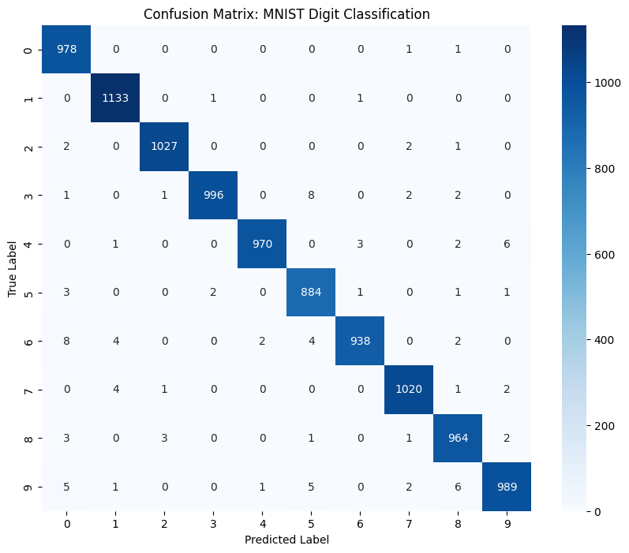

# Digit-Recognition-with-CNN
This project implements a Convolutional Neural Network (CNN) to classify handwritten digits from the classic MNIST dataset. It features a live web interface where users can draw digits and receive real-time predictions.
# 🔢 MNIST Digit Recognizer: End-to-End CNN Deployment

An interactive Deep Learning application that classifies handwritten digits (0-9) with high precision using a Convolutional Neural Network (CNN). The project is trained in Google Colab and deployed as a live web app via Streamlit.

## 🚀 Live Demo
**https://digit-recognition-with-cnn-8qxs2t2n7h2vmensdkhb5g.streamlit.app/**

## 🛠️ Technical Stack
- **Deep Learning:** TensorFlow, Keras
- **Web Interface:** Streamlit, Streamlit-Drawable-Canvas
- **Data Analysis:** NumPy, Matplotlib, Seaborn, Scikit-Learn
- **Deployment:** GitHub, Streamlit Cloud

## 🧠 Model Architecture
Unlike standard dense networks, this model uses a **CNN** to preserve the spatial structure of the digits:
1. **Conv2D Layer:** 32 filters (3x3), ReLU activation to extract edges and shapes.
2. **MaxPooling2D:** Downsampling to make the model translation-invariant.
3. **Conv2D Layer:** 64 filters (3x3) for complex pattern recognition.
4. **Flatten & Dense:** A 64-unit hidden layer with **Dropout (0.2)** to prevent overfitting.
5. **Output Layer:** 10 units with **Softmax** activation for probability distribution.

## 📊 Performance & Error Analysis
The model achieves an accuracy of **~99%** on the test set. 

### Confusion Matrix
To understand the model's "blind spots," I generated a confusion matrix. It reveals that the model occasionally confuses digits with similar structural features, such as **4 vs 9** and **5 vs 6**.



## 📂 Project Structure
- `app.py`: The Streamlit script handling the drawing canvas and model inference.
- `mnist_model.h5`: The trained CNN model weights.
- `requirements.txt`: Environment dependencies for deployment.
- `notebook.ipynb`: The Google Colab training workflow and evaluation.

## ⚙️ Local Installation
1. Clone the repo:
   ```bash
   git clone [https://github.com/SaniaK27/Digit-Recognition-with-CNN.git](https://github.com/SaniaK27/Digit-Recognition-with-CNN.git)
